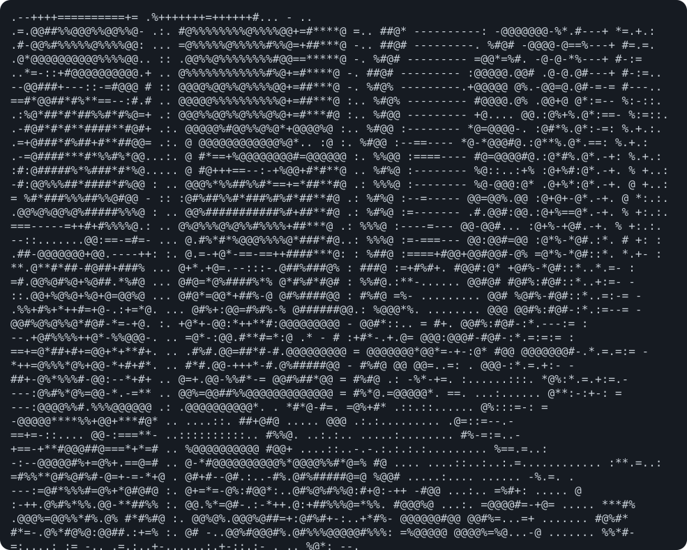

 

<table>
<tr>

<td width="50%" align="center" valign="middle">

</td>

<td width="50%" align="left" valign="middle">

<h3> About Me</h3>

Software Engineer focused on building scalable systems,
backend architecture, and data-driven applications.

💻 Backend & Full-Stack Development 
🏗️ Systems & Data Architecture 
🤖 AI / Machine Learning 
🔧 Building things from scratch

<h3>Main Skills</h3>

<h3>Studying<h3>

 

</td>

</tr>
</table>

